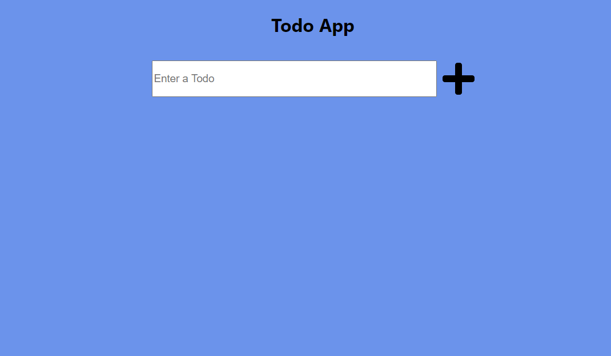
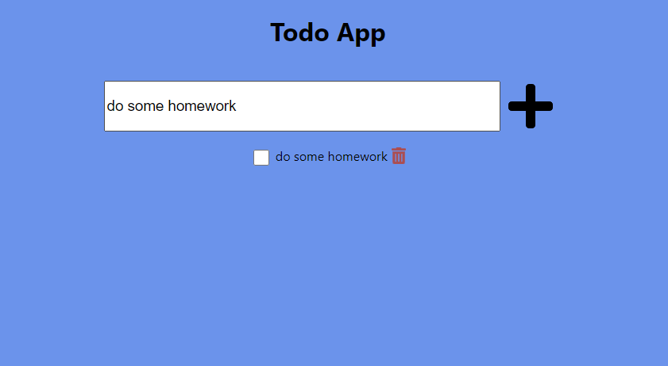
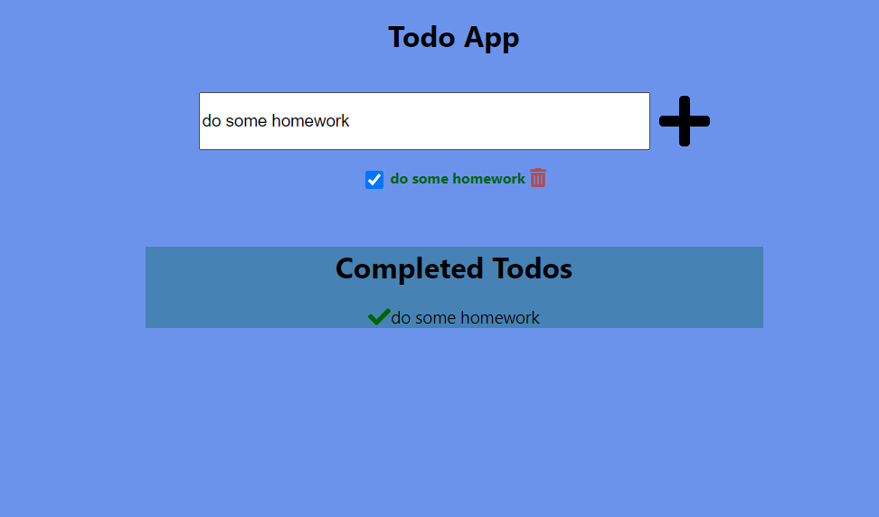

# Week7 React TodoApp

This project was bootstrapped with [Create React App](https://github.com/facebook/create-react-app).

## Available Scripts

In the project directory, you can run:

### `npm start`

Runs the app in the development mode.\
Open [http://localhost:3000](http://localhost:3000) to view it in the browser.

The page will reload if you make edits.\
You will also see any lint errors in the console.

# Screen snippets from the app

A todo can be added by clicking **+** icon

When a todo be added, it can be visible below

A todo canbe completed by clicking the checkbox element. When it's happen **Completed Todos** become visible

When checkbox element clicked again , only related todo
disappear from **Completed Todos**

# LocalStorage

When the page refreshed, todos are protected in the **localstorage**
